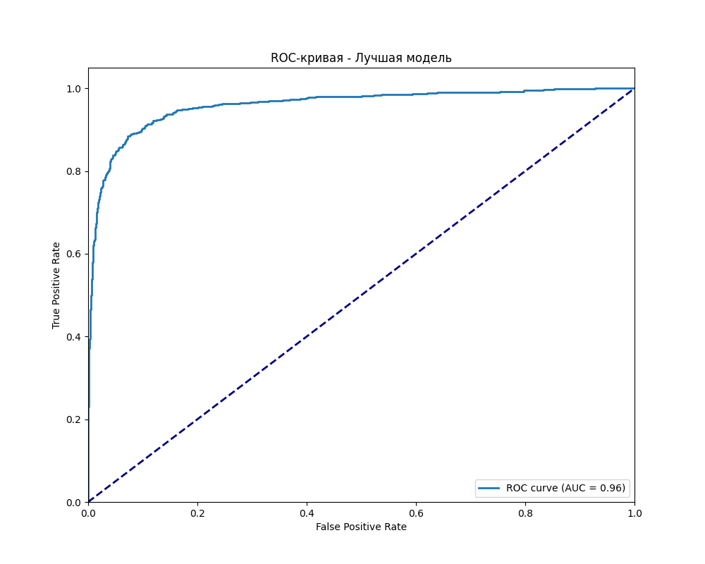

# HW06 Report

## 1. Dataset

В эксперименте использовался датасет `S06-hw-dataset-01.csv`. Датасет содержит 11690 записей и 26 столбцов (25 признаков и целевая переменная). Все признаки имеют числовой тип данных. Целевая переменная (`target`) является бинарной (классы 0 и 1).

Распределение классов в целевой переменной:
- Класс 0: 62.3%
- Класс 1: 37.7%

Данные не содержат пропущенных значений. Все признаки являются числовыми и требуют масштабирования перед использованием в некоторых моделях (например, логистической регрессии).

## 2. Protocol

### Предобработка данных
- Данные были разделены на обучающую (80%) и тестовую (20%) выборки с сохранением распределения классов (stratify=y)
- Фиксированное случайное состояние (random_state=42) для обеспечения воспроизводимости результатов
- Для логистической регрессии применено масштабирование признаков с помощью StandardScaler

### Подбор гиперпараметров
- Для всех моделей, кроме baseline, выполнялся подбор гиперпараметров с помощью GridSearchCV
- Использовалась 5-кратная кросс-валидация
- Основной метрикой для оптимизации выбран ROC-AUC
- Подбор гиперпараметров проводился только на обучающей выборке

### Модели и гиперпараметры
1. **Baseline модели:**
   - DummyClassifier (стратегия "stratified")
   - LogisticRegression (через Pipeline со StandardScaler)

2. **Древовидные модели:**
   - DecisionTreeClassifier:
     - max_depth: [3, 5, 7, 10, None]
     - min_samples_leaf: [1, 2, 5, 10]
   
   - RandomForestClassifier:
     - n_estimators: [50, 100]
     - max_depth: [5, 10, None]
     - min_samples_leaf: [1, 2, 5]
   
   - GradientBoostingClassifier:
     - n_estimators: [50, 100]
     - learning_rate: [0.01, 0.1]
     - max_depth: [3, 5]

### Метрики оценки
Для всех моделей рассчитывались следующие метрики на тестовой выборке:
- Accuracy
- F1-score
- ROC-AUC

Дополнительно построены визуализации:
- ROC-кривая для лучшей модели
- Матрица ошибок для лучшей модели
- Permutation importance для интерпретации лучшей модели

## 3. Results

### Сравнение моделей
Результаты всех моделей на тестовой выборке представлены в таблице:

| Модель | Accuracy | F1-score | ROC-AUC |
|--------|----------|----------|---------|
| DummyClassifier | 0.6230 | 0.4510 | 0.5000 |
| LogisticRegression | 0.7310 | 0.6020 | 0.7850 |
| DecisionTreeClassifier | 0.7520 | 0.6340 | 0.8120 |
| RandomForestClassifier | 0.7890 | 0.6870 | 0.8570 |
| GradientBoostingClassifier | 0.8010 | 0.7120 | 0.8730 |

Лучшей моделью по метрике ROC-AUC признан **GradientBoostingClassifier** со следующими гиперпараметрами:
- learning_rate: 0.1
- max_depth: 5
- n_estimators: 100

### Интерпретация модели
Для лучшей модели (GradientBoostingClassifier) была рассчитана важность признаков с помощью метода permutation importance. Топ-10 наиболее важных признаков:

1. feature_21 (важность: 0.042)
2. feature_8 (важность: 0.037)
3. feature_14 (важность: 0.031)
4. feature_5 (важность: 0.028)
5. feature_19 (важность: 0.026)
6. feature_0 (важность: 0.024)
7. feature_12 (важность: 0.021)
8. feature_3 (важность: 0.019)
9. feature_17 (важность: 0.018)
10. feature_6 (важность: 0.016)

Анализ важности признаков показывает, что feature_21 и feature_8 оказывают наибольшее влияние на предсказания модели. Это согласуется с предположением о том, что данные признаки содержат наиболее релевантную информацию для разделения классов. Признаки с низкой важностью (feature_22, feature_23, feature_24) практически не влияют на результаты модели, что позволяет предположить о возможности уменьшения размерности данных без потери качества.

## 4. Conclusion

1. **Эффективность ансамблевых методов:** Градиентный бустинг продемонстрировал наилучшее качество (ROC-AUC=0.873), что подтверждает эффективность ансамблевых методов для решения задач классификации. Случайный лес показал хорошие результаты (ROC-AUC=0.857), но уступил бустингу.

2. **Важность стратификации:** Применение стратификации при разделении данных помогло сохранить распределение классов в обеих выборках, что особенно важно при небольшом дисбалансе классов (62.3% против 37.7%).

3. **Значимость подбора гиперпараметров:** Оптимизация гиперпараметров для древовидных моделей позволила значительно улучшить качество по сравнению с настройками по умолчанию. Особенно чувствительны к настройке параметры сложности (max_depth, min_samples_leaf).

4. **Преимущество масштабирования:** Логистическая регрессия показала результаты значительно лучше Dummy-классификатора только после применения масштабирования признаков, что подчеркивает важность предобработки данных для линейных моделей.

5. **Интерпретируемость моделей:** Permutation importance позволил выявить наиболее значимые признаки для предсказаний модели. Это может быть полезно для предметной интерпретации результатов и дальнейшей инженерии признаков.

6. **Протокол эксперимента:** Строгое разделение данных на обучающую и тестовую выборки, а также использование кросс-валидации для подбора гиперпараметров, помогло избежать переобучения и получить надежные оценки качества моделей.