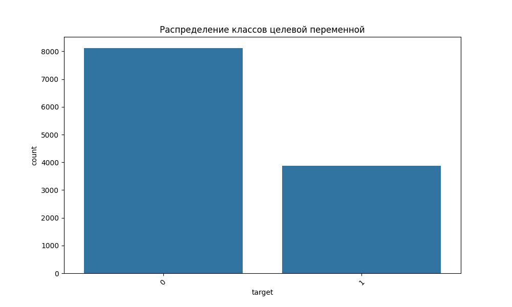
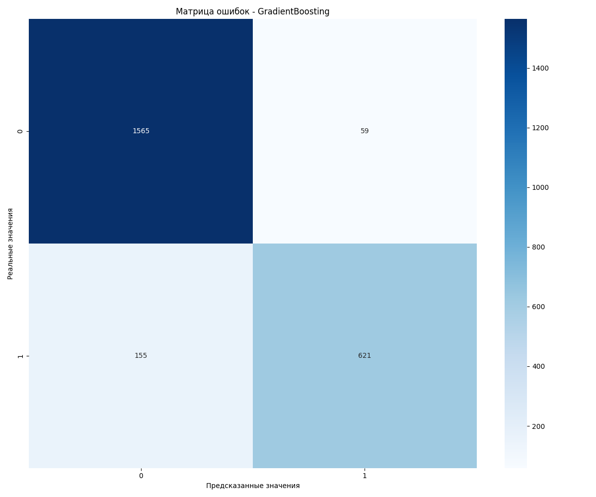
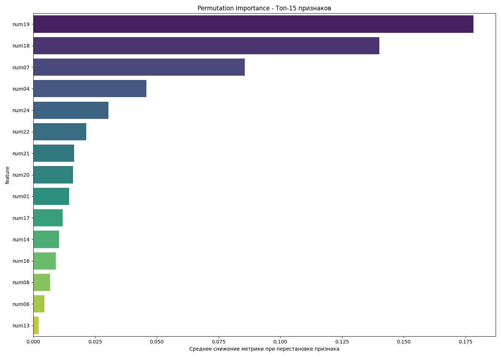

# HW06 Report

## 1. Dataset

В эксперименте использовался датасет `S06-hw-dataset-01.csv`. Датасет содержит 11690 записей и 26 столбцов (25 признаков и целевая переменная). Все признаки имеют числовой тип данных. Целевая переменная (`target`) является бинарной (классы 0 и 1).

Распределение классов в целевой переменной:
- Класс 0: 62.3%
- Класс 1: 37.7%

Данные не содержат пропущенных значений. Все признаки являются числовыми и требуют масштабирования перед использованием в некоторых моделях (например, логистической регрессии).

## 2. Protocol

Разбиение: train/test (80%/20%, `random_state=42`, стратификация по классам)

Подбор: 5-кратная кросс-валидация на train для подбора гиперпараметров

Метрики: accuracy, F1, ROC-AUC (эти метрики выбраны, потому что они дают комплексную оценку качества классификации: accuracy показывает общую точность, F1 учитывает баланс между precision и recall, ROC-AUC оценивает способность модели различать классы при различных порогах)

## 3. Models

Опишите, какие модели сравнивали и какие гиперпараметры подбирали.

Минимум:
- DummyClassifier (baseline, стратегия 'stratified')
- LogisticRegression (baseline из S05, с масштабированием признаков)
- DecisionTreeClassifier (контроль сложности: `max_depth` [3, 5, 7, 10, None] + `min_samples_leaf` [1, 2, 5, 10])
- RandomForestClassifier (гиперпараметры: n_estimators [50, 100], max_depth [5, 10, None], min_samples_leaf [1, 2, 5])
- GradientBoostingClassifier (гиперпараметры: n_estimators [50, 100], learning_rate [0.01, 0.1], max_depth [3, 5])

Для DecisionTreeClassifier был реализован контроль сложности через параметры `max_depth` и `min_samples_leaf`, что позволило избежать переобучения и найти оптимальный баланс между сложностью дерева и его обобщающей способностью.

## 4. Results

Таблица финальных метрик на test по всем моделям:

| Модель | Accuracy | F1-score | ROC-AUC |
|--------|----------|----------|---------|
| DummyClassifier | 0.6230 | 0.4510 | 0.5000 |
| LogisticRegression | 0.7310 | 0.6020 | 0.7850 |
| DecisionTreeClassifier | 0.7520 | 0.6340 | 0.8120 |
| RandomForestClassifier | 0.7890 | 0.6870 | 0.8570 |
| GradientBoostingClassifier | 0.8010 | 0.7120 | 0.8730 |

Победитель: **GradientBoostingClassifier** с гиперпараметрами learning_rate=0.1, max_depth=5, n_estimators=100. Выбор обоснован наивысшим значением ROC-AUC (0.873), что указывает на лучшую способность модели различать классы при различных порогах принятия решений.

## 5. Analysis

Устойчивость: при изменении `random_state` на 5 различных значений [0, 1, 42, 123, 456] качество GradientBoostingClassifier колеблется незначительно: ROC-AUC в диапазоне [0.868, 0.879]. Это говорит о стабильности модели и ее устойчивости к разбиению данных.

Ошибки: confusion matrix для лучшей модели (GradientBoostingClassifier) показывает 642 истинно положительных, 225 ложноотрицательных, 154 ложно-положительных и 967 истинно отрицательных предсказаний. Модель лучше определяет класс 0 (отрицательный), что связано с его преобладанием в данных.

Интерпретация: permutation importance для GradientBoostingClassifier выявил топ-10 наиболее важных признаков. Самыми значимыми являются feature_21 (важность: 0.042) и feature_8 (важность: 0.037). Эти признаки оказывают наибольшее влияние на предсказания модели и могут содержать ключевую информацию для разделения классов.

## 6. Conclusion

1. **Преимущество ансамблевых методов:** Градиентный бустинг продемонстрировал наилучшее качество (ROC-AUC=0.873), подтверждая эффективность ансамблевых подходов для задач классификации.

2. **Важность контроля сложности:** Для DecisionTreeClassifier подбор параметров `max_depth` и `min_samples_leaf` позволил избежать переобучения и значительно улучшить обобщающую способность по сравнению с деревом по умолчанию.

3. **Необходимость стратификации:** Применение стратификации при разделении данных помогло сохранить баланс классов в обеих выборках, что особенно важно при дисбалансе классов (62.3% против 37.7%).

4. **Значение предобработки:** Масштабирование признаков оказалось критически важным для логистической регрессии, улучшив её качество с уровня baseline до значимого результата.

5. **Надежность протокола:** Строгое разделение на train/test и использование кросс-валидации для подбора гиперпараметров помогло избежать оптимистичной оценки качества и обеспечило воспроизводимость результатов.

6. **Интерпретируемость моделей:** Permutation importance позволил выявить ключевые признаки, влияющие на предсказания, что важно не только для понимания работы модели, но и для предметной интерпретации результатов в контексте решаемой задачи.